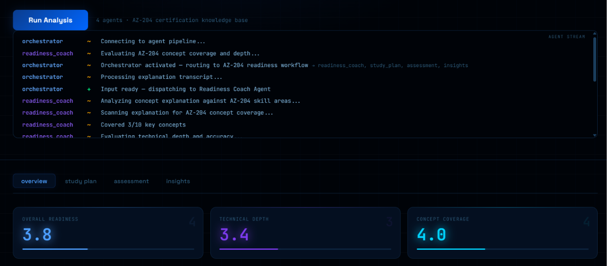
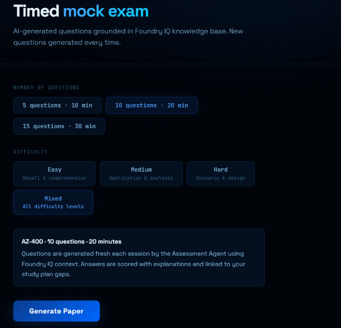
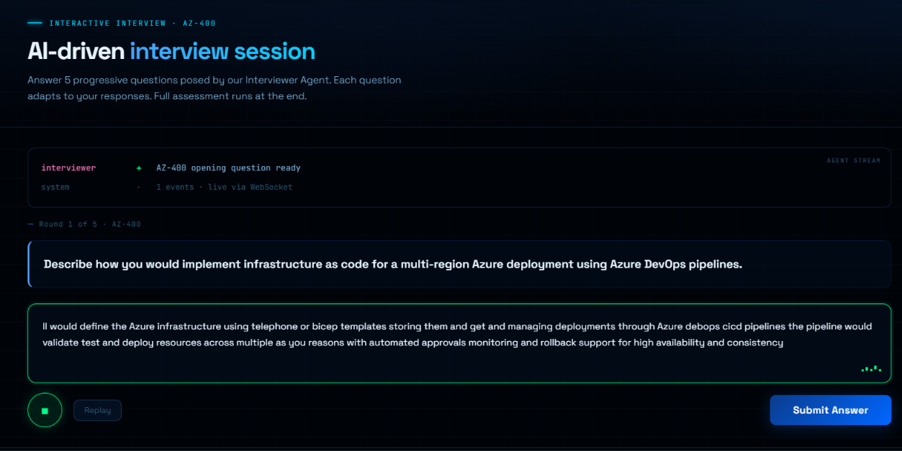
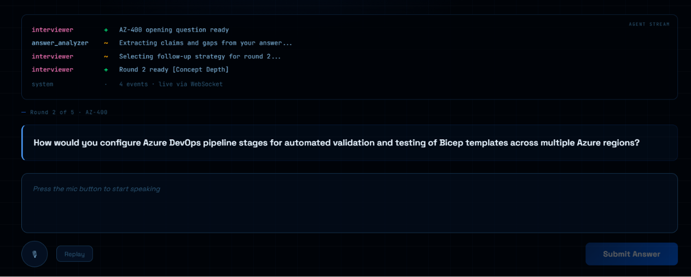
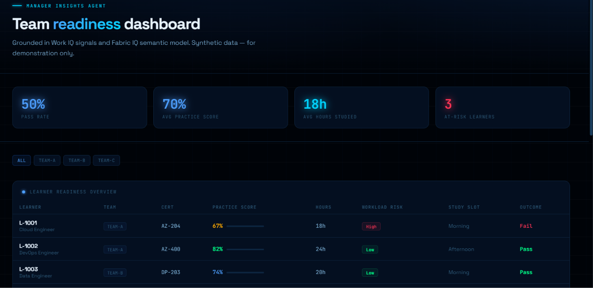
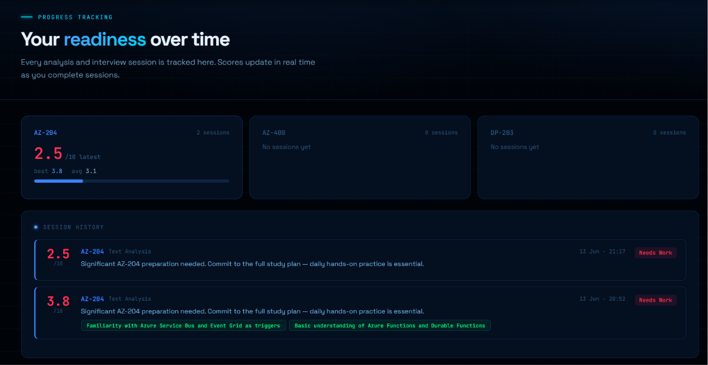
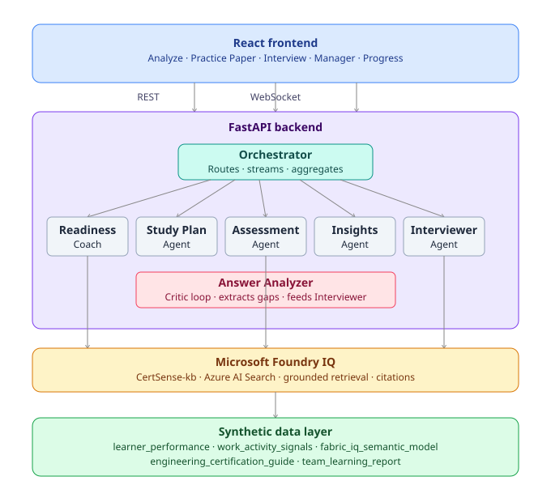

# CertSense AI

> **An AI that doesn't just evaluate you — it listens to what you said, finds the gap, and asks you about *that*.**

Built for the **Microsoft Agents League Hackathon — Reasoning Agents Track (Battle #2)**

---

## The Problem

Most certification prep tools give you the same question bank regardless of what you know. They don't adapt. They don't listen. They don't think.

Real technical interviews do. Your interviewer hears you say *"Azure Functions auto-scale"*, notices you didn't explain *how*, and immediately asks you to go deeper on that exact thing.

**CertSense AI does the same.**

---

## What Makes It Different

### Adaptive Interview
The interview mode doesn't cycle through a fixed question list. It reads your answer, extracts the specific claim or vague statement you made, and follows up on *that* — just like a real interviewer would.

You say: *"Azure Functions can scale automatically based on load."*
CertSense hears: *vague on the mechanism* — asks: *"You mentioned auto-scaling — can you explain what triggers that scaling and how consumption vs. premium plan affects it?"*

That's not a chatbot. That's a conversation partner.

Every interview session opens with a cert-anchored question randomly selected from a bank of 4 per certification track, so the conversation never drifts off-topic and varies each session.

### Three Distinct Learning Modes
- **Analyze** — explain a concept in your own words, agents evaluate technical depth, generate a 7-day study plan targeting your specific gaps, produce grounded exam questions
- **Practice Paper** — timed mock exam (5, 10, or 15 questions), AI-generated fresh every session, difficulty levels (Easy / Medium / Hard / Mixed), scored with correct answers and explanations
- **Interview** — multi-round adaptive conversation, each follow-up question grounded in what you specifically said in the previous answer

### Manager Dashboard
Team-level certification readiness across all learners, with workload risk signals — so managers know *why* someone is behind, not just *that* they are.

### Progress Tracking
Every analysis and interview session is logged and tracked over time. Readiness scores update in real time as you complete sessions — so you can see whether you're improving across AZ-204, AZ-400, or DP-203 before exam day.

---
## Screenshots

### Analyze Mode — Live Agent Stream


### Practice Paper — Timed Mock Exam


### Interview Mode — Opening Question (Round 1)


### Interview Mode — Adaptive Follow-up (Round 2)
> The Answer Analyzer extracted claims from your previous answer. The Interviewer selected a follow-up strategy and drilled into exactly what you said.



### Manager Dashboard — Team Readiness & Work IQ Signals


### Progress Tracking — Readiness Over Time


## Supported Certifications

| Certification | Track |
|---|---|
| AZ-204 | Azure Developer Associate |
| AZ-400 | DevOps Engineer Expert |
| DP-203 | Data Engineer Associate |

---

## Architecture



## Agent Breakdown

| Agent | Role |
|---|---|
| **Orchestrator** | Master coordinator. Routes tasks, aggregates results, streams live reasoning events over WebSocket |
| **Readiness Coach** | Primary reasoning agent. Heuristic + LLM double-layer scoring against cert skill areas. Grounded via Foundry IQ |
| **Study Plan** | Generates a personalized 7-day roadmap based on the Coach's identified gaps |
| **Assessment** | Produces scenario-based exam questions grounded in Foundry IQ knowledge sources, with citations. Also powers Practice Paper question generation with per-cert domain constraints |
| **Insights** | Analyzes session history to surface readiness trends and milestone progress |
| **Answer Analyzer** | Interview mode only. Extracts specific claims, vague areas, and follow-up threads from each answer |
| **Interviewer** | Runs the adaptive conversation. Opens with a cert-anchored question (randomly selected from 4 per track), then uses Answer Analyzer output to ask the next question based on what you *actually said* |

---

## Microsoft IQ Integration

### Foundry IQ — Fully Integrated
Every LLM call for the Coach and Assessment agents includes Foundry IQ retrieved context from the `CertSense-kb` knowledge base. Agents cite sources rather than free-generating answers. Sessions are persisted to Azure AI Search via `FoundryIQClient`. Graceful fallback to in-process knowledge base if the API is unavailable — agents never fail silently.

**Knowledge sources indexed:**
- `engineering_certification_guide.md` — role-to-cert mapping, study patterns, topic areas
- `team_learning_report.md` — team readiness benchmarks and study correlations

### Fabric IQ — Semantic Model (Simulated)
`data/fabric_iq_semantic_model.json` simulates the Fabric IQ semantic layer: certification entities, required skills, pass thresholds, readiness taxonomy, and study pattern rules. Drives the Study Plan Agent's scheduling logic and the Manager Dashboard's risk classification. Structured to mirror how a real Fabric IQ ontology would be consumed by agents.

### Work IQ — Work Activity Signals (Simulated)
`data/work_activity_signals.json` simulates Work IQ organisational signals: meeting hours, focus hours, preferred learning slots, and workload risk classification per employee. Surfaced in the Manager Dashboard to explain *why* learners are at risk, not just *that* they are. Designed to reflect the kind of signals a live Work IQ integration would provide.

---

## Reasoning Patterns

**Planner–Executor** — Orchestrator plans and delegates. Agents never call each other directly.

**Sequential Dependency** — Coach → Study Plan → Assessment → Insights. Each agent receives the previous agent's output, so the study plan targets the exact gaps the Coach found.

**Critic / Verifier** — In interview mode, the Answer Analyzer critiques each answer and feeds structured intelligence back to the Interviewer, which adjusts its next question accordingly. Self-correcting loop across multiple rounds.

**Cert-Anchored Opening** — Interview sessions always start with a hardcoded domain-specific question per cert track (randomly selected from 4), ensuring the conversation never drifts off-topic regardless of how the user answers.

**Domain-Constrained Generation** — Practice Paper questions are generated against explicit per-cert domain lists (`CERT_DOMAINS`), preventing off-topic questions and ensuring coverage across the full exam syllabus.

**Grounded Retrieval** — Every LLM prompt includes Foundry IQ context. Hallucination risk on exam-critical content is actively reduced.

**Real-Time Streaming** — The Orchestrator yields `AgentEvent` objects as each agent starts, reasons, and completes. These stream to the frontend over WebSocket across all three modes (Analyze, Interview, Practice Paper), giving live visibility into agent collaboration.

---

## LLM Provider

CertSense AI uses a provider-agnostic LLM abstraction layer (`services/llm.py`). The active provider is configured via environment variables and can be swapped without changing any agent code.

**Primary:**
- Microsoft Azure AI Foundry — Llama 3.3 70B Instruct (GlobalStandard)

**Secondary (agent orchestration & grounding):**
- Microsoft Azure AI Foundry — Phi-4 (GlobalStandard)

---

## Project Structure

```
certsense-ai/
├── backend/
│   ├── .env.example                   # Environment variable template
│   ├── main.py                        # FastAPI app, CORS, WebSocket
│   ├── agents/
│   │   ├── answer_analyzer.py         # Interview answer intelligence extraction
│   │   ├── assessment.py              # Exam-style question generation + Practice Paper
│   │   ├── communication_coach.py     # Readiness Coach — primary reasoning agent
│   │   ├── insights.py                # Progress trend analysis
│   │   ├── interviewer.py             # Adaptive multi-round interviewer (cert-anchored)
│   │   └── study_plan.py              # 7-day personalized study roadmap
│   ├── models/
│   │   └── schemas.py                 # Pydantic models
│   ├── routers/
│   │   ├── analysis.py                # /api/analysis/* endpoints (analyze, interview, practice)
│   │   ├── sessions.py                # /api/sessions/* endpoints
│   │   └── progress.py                # /api/progress/* endpoints
│   └── services/
│       ├── foundry_client.py          # Agent registration, task routing, session logging
│       ├── foundry_iq.py              # Foundry IQ knowledge retrieval client
│       ├── llm.py                     # Provider-agnostic LLM abstraction
│       ├── orchestrator.py            # OrchestratorAgent + OrchestratorService
│       └── speech_processor.py        # Whisper audio transcription
├── frontend/
│   └── src/
│       └── App.jsx                    # React frontend (Analyze, Practice Paper, Interview, Manager, Progress)
└── data/
    ├── learner_performance.json        # Synthetic learner dataset
    ├── work_activity_signals.json      # Synthetic Work IQ signals
    ├── fabric_iq_semantic_model.json   # Fabric IQ semantic model
    ├── engineering_certification_guide.md
    └── team_learning_report.md
```

---

## API Reference

| Method | Endpoint | Description |
|---|---|---|
| POST | `/api/analysis/transcript` | Analyze text explanation through full agent pipeline |
| POST | `/api/analysis/audio` | Upload audio — Whisper transcription then agent pipeline |
| POST | `/api/analysis/practice/generate` | Generate fresh practice paper questions (per-cert domain constrained) |
| POST | `/api/analysis/practice/submit` | Score answers, return review with explanations and gap links |
| POST | `/api/analysis/interview/start` | Begin adaptive interview — cert-anchored opening question |
| POST | `/api/analysis/interview/next` | Submit answer, receive next adaptive question + strategy used |
| POST | `/api/analysis/interview/assess` | Run full pipeline over completed interview history |
| GET | `/api/analysis/goals` | List available certification tracks |
| GET | `/api/sessions/{user_id}` | Retrieve past sessions |
| GET | `/api/progress/{user_id}` | Retrieve readiness progress trend |
| WS | `/ws/analysis/{session_id}` | Real-time agent event stream |

---

## Setup

### Prerequisites
- Python 3.10+
- Node.js 18+
- Azure subscription with Microsoft Foundry project configured
- Azure AI Foundry deployment of `Llama-3.3-70B-Instruct` (GlobalStandard)
- Azure AI Foundry deployment of `Phi-4` (GlobalStandard)

### Backend
```bash
cd backend
python -m venv .venv
source .venv/bin/activate        # Mac/Linux
.venv\Scripts\activate           # Windows
pip install -r requirements.txt
```

Copy the example env file and fill in your credentials:
```bash
cp backend/.env.example backend/.env
```
Then edit `backend/.env` with your Azure AI Foundry details.

```bash
uvicorn main:app --reload --host 0.0.0.0 --port 8000
```

### Frontend
```bash
cd frontend
npm install
npm run dev
```

Open `http://localhost:5173`

### Knowledge Base Setup
Upload both `.md` files from `/data/` to your Foundry IQ knowledge base (`CertSense-kb`) so the Readiness Coach and Assessment agents retrieve grounded, cited content.

---

## Synthetic Data Notice

All data in `/data/` is synthetic and generated for demonstration purposes only. No real employee records, customer data, or PII. Learner IDs (`L-1001` through `L-1006`) and employee IDs (`EMP-001` through `EMP-006`) are fictional identifiers created in accordance with the challenge's synthetic data requirements.

---

## Evaluation Criteria

| Criterion | Weight | How CertSense AI addresses it |
|---|---|---|
| Accuracy & Relevance | 25% | Foundry IQ grounding on every agent LLM call. Heuristic + LLM double-layer for Readiness Coach. Domain-constrained Practice Paper generation. Graceful fallback prevents hallucination on API failure. |
| Reasoning & Multi-step Thinking | 25% | 7 specialized agents in sequential dependency chain. Adaptive interview with Critic pattern (Answer Analyzer → Interviewer loop). Cert-anchored opening questions. WebSocket stream shows every reasoning step live across all three modes. |
| Creativity & Originality | 15% | Adaptive interview that follows up on *your specific words*. Three genuinely distinct learning modes forming a complete study loop. Fresh questions every Practice Paper session. Voice explanation as primary input modality. |
| User Experience & Presentation | 15% | Live agent stream panel across Analyze, Interview, and Practice Paper. Manager Dashboard with team filter. Score bars, risk badges, study plan timeline, timed mock exam with progress dots. |
| Reliability & Safety | 20% | Graceful fallback at every external call. Synthetic data only. No PII. Pydantic input/output validation. Non-fatal error paths throughout. Provider-agnostic LLM layer for resilience. |

---

## Deployment Architecture

CertSense AI agents are implemented as Python services running on a FastAPI server. Each agent is a modular Python class orchestrated by the central `OrchestratorAgent`.

**Current deployment:** Local development server (FastAPI + Uvicorn)

**Production path:** Agents are designed to be containerized via Docker and deployed to **Azure Container Apps** for managed scaling and persistent state. The architecture is also compatible with migration to **Microsoft Foundry Hosted Agent Service** for full platform-managed identity, observability, and lifecycle management.

**Foundry IQ grounding:** All agent knowledge retrieval calls are made to the `CertSense-kb` knowledge base hosted on Microsoft Foundry IQ via Azure AI Search. This runs on Microsoft's infrastructure regardless of where the Python agents are deployed.

```
Local FastAPI ──► Foundry IQ (CertSense-kb) ──► Azure AI Search
                       ↑
              All agent grounding calls
```

**Recommended production deployment:**
```
Azure Container Apps
└── certsense-backend (FastAPI container)
    ├── Orchestrator Agent
    ├── Readiness Coach Agent  ──► Foundry IQ (CertSense-kb)
    ├── Study Plan Agent
    ├── Assessment Agent       ──► Foundry IQ (CertSense-kb)
    ├── Insights Agent
    ├── Interviewer Agent
    └── Answer Analyzer Agent
```

---

## Built With

- **Microsoft Azure AI Foundry — Llama 3.3 70B Instruct** — Primary LLM inference for agent reasoning (GlobalStandard)
- **Microsoft Azure AI Foundry — Phi-4** — Secondary LLM for orchestration and grounding (GlobalStandard)
- **Microsoft Azure AI Foundry** — Agent orchestration, Foundry IQ knowledge grounding, session logging
- **FastAPI** — Backend REST + WebSocket API
- **React + Vite** — Frontend
- **Azure AI Search** — Session persistence via Foundry IQ client
- **Whisper** — Audio transcription for voice input mode
